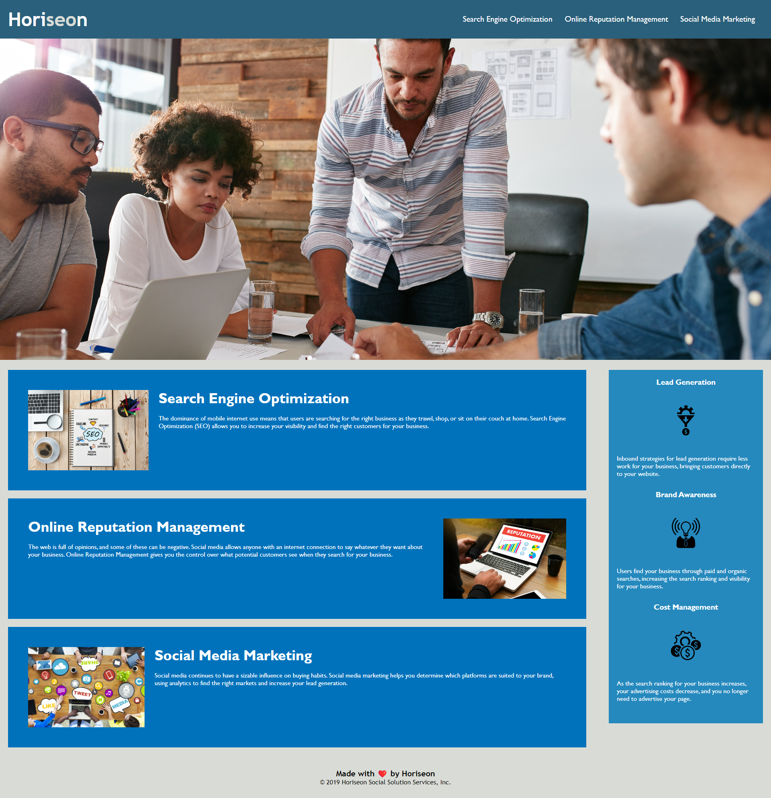

# Horisen accessibility website

Welcome to the Horiseon website's README. This document provides an overview of how we prioritize and 
implement web accessibility to ensure that all users, 
including those with disabilities, can access and interact with our content effectively. 
My main motivation is to ensure that all individuals, regardless of their physical or cognitive impairments, 
can access and interact with this website. Web accessibility promotes inclusivity by breaking down barriers and 
allowing a broader audience to participate in online activities. Making this website accessible fosters a sense of 
connection and community. Knowing that your digital presence is accessible to all can be personally rewarding and 
fulfilling. The primary problem solved by making this website accessible is the exclusion of individuals with 
disabilities. To also avoid poor user experiences, not only for individuals with disabilities but for all users. 
Limiting our potential audience and market share. I learnt during this process that using semantic HTML and 
providing descriptive alt text for images, can improve a website's search engine ranking and inaccessible websites 
may suffer from lower visibility in search engine results. 

## Installation

Theres no installation required, this is a standard HTML file.
    
## Usage/Examples

## Credits

- Guide on how to construct a README: 
https://coding-boot-camp.github.io/full-stack/github/professional-readme-guide
- Semantic elements: 
https://www.w3schools.com/html/html5_semantic_elements.asp
- CSS selectors guide: 
https://www.w3schools.com/cssref/css_selectors.php
- Tutorial on accessible web design: https://youtu.be/-ao_Kc_8rpE?si=_Yf8j-0sG3-Lr1cQ
- How to write Git commit messages: https://www.freecodecamp.org/news/how-to-write-better-git-commit-messages/#:~:text=See%20the%20section%20on%20Conventional,be%20restricted%20to%2072%20characters

## License

[MIT](https://choosealicense.com/licenses/mit/)
